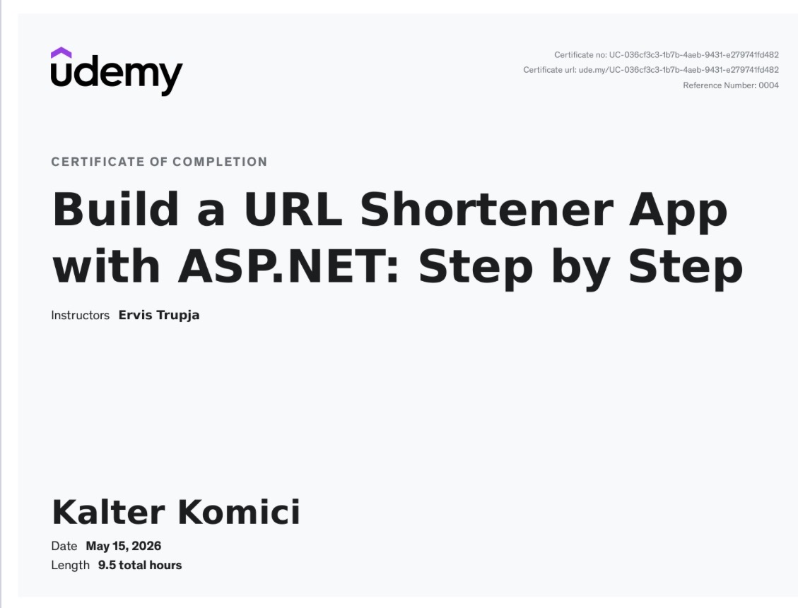

# ASP.NET URL Shortener Course Proof

This repository contains my submission proof for the Udemy course **Build a URL Shortener App with ASP.NET: Step by Step** by Ervis Trupja.

## Proof of Completion

- Student: Kalter Komici
- Completion date: May 15, 2026
- Certificate URL: https://ude.my/UC-036cf3c3-1b7b-4aeb-9431-e279741fd482
- Forked source repository: https://github.com/kkomici24-bit/Shortly

## Certificate Screenshot

